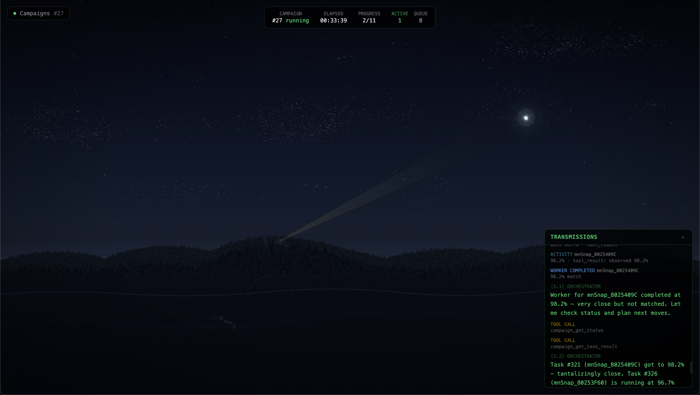

System for decompiling Super Smash Bros Melee. Contributions are made to [this repo](https://github.com/doldecomp/melee).
Meant to work with OpenAI or Anthropic subscriptions by running Claude Code and Codex in isolated containers. 

UI: Constellations show large groupings, with each star representing a specific function. Displays accurate logs of the currently running campaign.


Campaign CLI:
```bash
decomp-agent --config config/default.toml campaign launch melee/mn/mnsnap.c --orchestrator-provider claude --worker-provider-policy claude --max-active-workers 2 --timeout-hours 8
decomp-agent --config config/default.toml campaign stop <id>
decomp-agent --config config/default.toml campaign cleanup-workers
```
